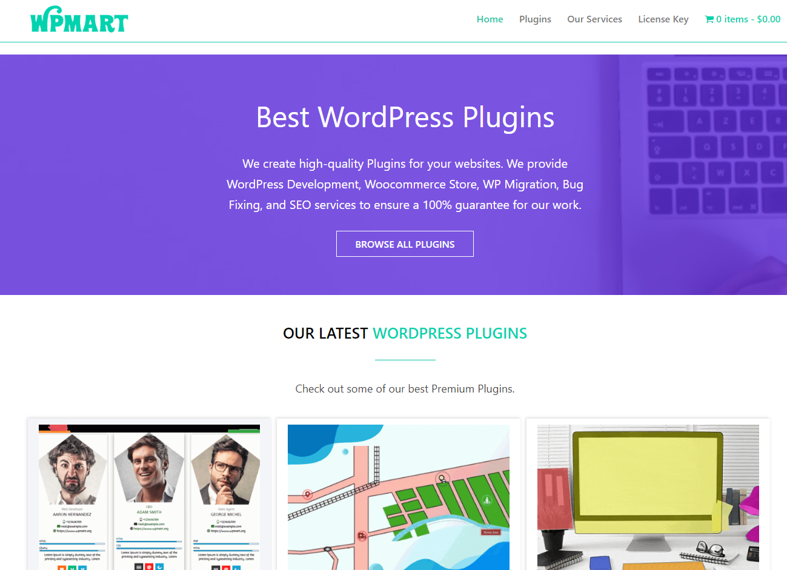

# WpMart Portfolio Theme

A sleek and modern portfolio theme designed by WpMart. Perfect for showcasing your work, photography, designs, and other creative projects.

 <!-- Assuming you have a screenshot.png in your theme's root directory -->

## Features

- Responsive design
- Gutenberg block editor support
- Customizable colors and fonts
- Widget-ready areas in the footer
- Integrated social media menu
- SEO optimized

## Requirements

- WordPress 5.0 or higher
- PHP 7.0 or higher

## Installation

1. Download the theme ZIP file from [WpMart](https://wpmart.com/themes/wpmart-portfolio).
2. In your WordPress Dashboard, go to **Appearance > Themes**.
3. Click on **Add New** and then **Upload Theme**.
4. Upload the ZIP file and activate the theme.

## Customization

The theme comes with a powerful customizer for you to adjust according to your preferences. Go to **Appearance > Customize** in your WordPress Dashboard to start personalizing your site.

## Support

For support, bug reporting, or to request new features, please visit [WpMart Support](https://wpmart.com/support).

## Changelog

### Version 1.0 - 2023-08-28

- Initial release.

## Credits

- Designed by [WpMart](https://wpmart.com)
- Based on Underscores starter theme

## License

This theme is licensed under the GNU General Public License v2 or later. You can find the full license text in the LICENSE file.
